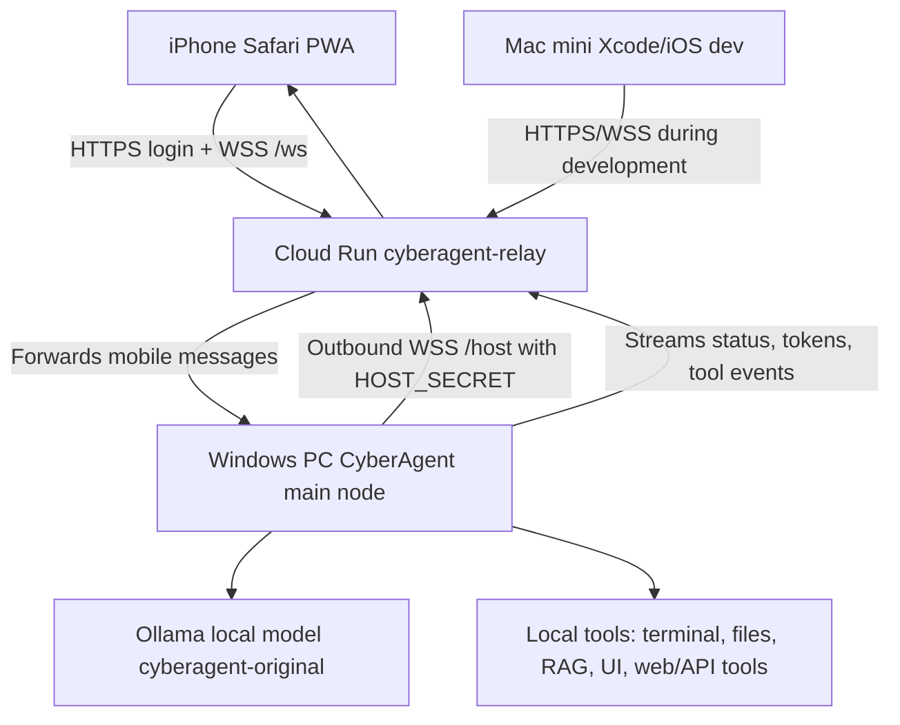

# CyberAgent Architecture

## Current Runtime Topology



## Components

### Windows Main Node

Path:

```text
C:\Users\steve\cyber-llm\agent-native
```

Entry point:

```text
main.py
```

Responsibilities:

- Desktop PySide UI.
- Ollama model calls.
- Local tool execution.
- RAG and memory.
- Conversation persistence.
- Mobile API server.
- Outbound relay connection to Cloud Run.

Key files:

- `main.py`: application bootstrap, environment loading, UI startup, relay startup.
- `app/ollama_client.py`: main local agent/Ollama loop.
- `app/api/agent_runner.py`: event-based runner used by mobile/WebSocket flows.
- `app/api/server.py`: local web API/PWA server.
- `app/api/relay_connector.py`: outbound websocket client from PC to Cloud Run.
- `app/memory.py`: layered memory compaction.
- `app/database.py`: SQLite persistence.
- `app/tools.py`: main local tool catalog.
- `app/tool_router.py`: tool routing logic.
- `app/widgets/main_window.py`: desktop app main window.
- `app/widgets/chat_panel.py`: chat UI.
- `app/widgets/tool_card.py`: visible tool/action cards.
- `app/web/`: local PWA files.

Desktop control capabilities now live in `app/tools.py`:

- `list_monitors`: connected displays, coordinates, work areas, primary flag, scale.
- `active_window`: foreground window title, hwnd, PID, process, rect.
- `list_windows`: visible windows with title/process/geometry.
- `focus_window`: bring target window to foreground.
- `click_screen`: absolute-coordinate mouse click.
- `type_text`: Unicode text typing into the active field.
- `hotkey`: keyboard shortcuts such as `ctrl+l`, `tab`, `enter`, `f11`.
- `ocr_screen`: screenshot plus OCR when Tesseract/pytesseract are installed.
- `ui_tree`: Windows UI Automation tree for active/target window.
- `fill_form`: sequential click/type/hotkey/wait automation.
- `credential_lookup`: Windows Credential Manager and Chromium credential metadata lookup, with best-effort reveal.

These tools are intended to let the agent operate normal desktop workflows with an inspect-act-verify loop:

1. inspect monitors/windows/screenshot/UI tree,
2. focus the correct window,
3. perform click/type/hotkey steps,
4. verify with screenshot/OCR/UI tree,
5. report progress in the chat action stream.

Example target workflow:

```text
Open a browser, navigate to Netflix, enter credentials supplied by the user,
search a series, start episode 1 from the beginning, enter fullscreen on display 1,
and confirm playback with screenshot/active-window state.
```

### Cloud Run Relay

Path:

```text
relay/
```

Responsibilities:

- Stable public HTTPS endpoint.
- Login and JWT cookie.
- PWA hosting.
- Static assets.
- Host WebSocket endpoint for the Windows PC.
- Mobile WebSocket endpoint for browser/iPhone clients.
- In-memory routing between mobile sessions and the connected PC.

Key files:

- `relay/main.py`: FastAPI relay.
- `relay/deploy.ps1`: deploy helper for Google Cloud Run.
- `relay/Dockerfile`: Cloud Run container.
- `relay/requirements.txt`: Python dependencies.
- `relay/web/index.html`: mobile app shell.
- `relay/web/app.js`: PWA client logic.
- `relay/web/style.css`: PWA styling.
- `relay/web/login.html`: login page.
- `relay/web/login.css`: login styling.
- `relay/web/sw.js`: PWA service worker.

Important endpoints:

```http
GET  /
GET  /login
GET  /api/status
GET  /api/auth/status
POST /api/auth/login
POST /api/auth/logout
WS   /host?secret=<HOST_SECRET>
WS   /ws
```

### Mobile PWA

Responsibilities:

- iPhone browser access.
- Login against Cloud Run.
- Chat streaming.
- Display assistant status.
- Display tool calls/action rows.
- Send approvals/stops where supported.
- Reconnect after network changes.

Limitations:

- Browser APIs do not expose full native iOS device control.
- Bluetooth and deeper device integrations require a native iOS app.

## Message Flow

1. PC starts CyberAgent.
2. `main.py` loads `RELAY_URL` and `RELAY_HOST_SECRET`.
3. `app/api/relay_connector.py` opens outbound WebSocket:

```text
wss://cyberagent-relay-819820880956.us-central1.run.app/host?secret=<HOST_SECRET>
```

4. iPhone logs into Cloud Run and opens:

```text
wss://cyberagent-relay-819820880956.us-central1.run.app/ws
```

5. Relay assigns a `session_id`.
6. Mobile sends user message with session metadata.
7. Relay forwards it to the PC host WebSocket.
8. PC creates an `AgentRunner`.
9. Agent streams events:

```json
{"type":"status","data":"..."}
{"type":"token","data":"..."}
{"type":"tool_call","tool_id":"...","name":"...","args":{}}
{"type":"tool_result","tool_id":"...","result":"..."}
{"type":"done","data":"..."}
{"type":"error","data":"..."}
```

10. Relay forwards events back to the mobile session.

## Memory Strategy

The current strategy is layered memory for a local model with limited context:

- Keep a short window of recent turns.
- Maintain an accumulated conversation summary.
- Include only relevant RAG fragments.
- Compact large tool results.
- Store tool outputs by reference or short summary when possible.
- Avoid appending status lines to assistant memory.

This was added to address context overflow errors such as:

```text
request exceeds available context size
```

## Cloud Run Static Asset Fix

The deployed relay HTML references:

```html
/static/style.css
/static/app.js
/static/login.css
```

But files currently live directly in:

```text
relay/web/
```

`relay/main.py` therefore mounts `/static` with fallback to `WEB_DIR`:

```python
STATIC_DIR = WEB_DIR / "static"
app.mount(
    "/static",
    StaticFiles(directory=str(STATIC_DIR if STATIC_DIR.exists() else WEB_DIR)),
    name="static",
)
```

Without this fallback, the mobile app loads HTML without CSS and looks broken.

## Operational Checks

Cloud Run status:

```powershell
Invoke-RestMethod -Uri https://cyberagent-relay-819820880956.us-central1.run.app/api/status
```

Expected:

```json
{"relay": true, "pc_online": true}
```

Process inspection on Windows:

```powershell
Get-CimInstance Win32_Process |
  Where-Object { $_.Name -match 'pythonw|python' } |
  Select-Object ProcessId,Name,ExecutablePath,CommandLine
```

Asset verification:

```powershell
Invoke-WebRequest -Uri https://cyberagent-relay-819820880956.us-central1.run.app/static/style.css -UseBasicParsing
Invoke-WebRequest -Uri https://cyberagent-relay-819820880956.us-central1.run.app/static/app.js -UseBasicParsing
```
