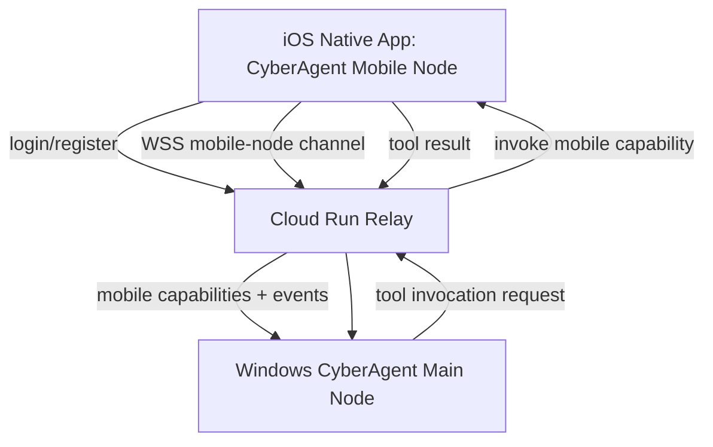

# PRD - CyberAgent iOS Native Extension

## Goal

Build a native iOS companion app that turns the iPhone into an extension node of CyberAgent while keeping the Windows PC as the main inference/tool host.

The iPhone app is not a replacement for the desktop agent. It should register mobile capabilities that the main agent can call through Cloud Run.

## Primary User

Single owner/operator:

- Uses Windows PC as the always-on CyberAgent node.
- Uses Mac mini for Xcode development.
- Uses iPhone as mobile console and mobile capability provider.

## Why Native iOS

The current PWA is useful for chat and remote control, but iOS Safari does not expose enough system capability for the desired device-extension behavior.

Native app is required or strongly preferred for:

- CoreBluetooth/BLE scanning and interactions.
- Reliable notifications.
- App Intents and Shortcuts integration.
- Native background behavior where iOS allows it.
- Local network permission handling.
- Camera/location/media permissions with native UX.
- Potential SSH integration through embedded library or delegated Shortcuts.

## Non-Goals For First Prototype

- No App Store publication.
- No TestFlight requirement.
- No multi-user admin panel.
- No replacement of the Windows PC as main host.
- No deep MDM-style control of the iPhone. iOS does not allow arbitrary full device control for normal apps.

## Distribution For Beta

For current beta, use Mac mini + Xcode + personal iPhone.

Apple Developer paid membership is not required to start. With free Apple ID signing, the app can be installed from Xcode on the developer's own iPhone, but normally needs to be reinstalled periodically when the provisioning expires. This is acceptable for the beta stage.

## High-Level Architecture



## Capability Model

The iPhone app should advertise capabilities to the agent.

Example registration payload:

```json
{
  "node_type": "ios",
  "device_name": "Steve iPhone",
  "capabilities": [
    "ios.notify",
    "ios.camera.capture",
    "ios.location.current",
    "ios.shortcuts.run",
    "ios.ble.scan",
    "ios.ssh.run"
  ]
}
```

Capabilities should be explicit and inspectable in the app UI.

## MVP Feature Set

### 1. Authentication

- Login against existing Cloud Run relay.
- Reuse relay URL:

```text
https://cyberagent-relay-819820880956.us-central1.run.app
```

- Store session securely in iOS Keychain.
- Show connection state.

### 2. Node Registration

- Register the iPhone as a mobile node.
- Send device metadata:
  - device name
  - app version
  - iOS version
  - capabilities
  - last seen timestamp

### 3. Live Status Screen

Show:

- Cloud Run reachable.
- PC online/offline from `/api/status`.
- WebSocket connected/disconnected.
- Registered capabilities.
- Recent tool invocations.
- Last error.

### 4. Chat View

The native app can either:

- Wrap the existing chat behavior natively, or
- Open the PWA in an internal browser while the native layer handles device tools.

Recommended first step: keep chat primarily in PWA/native web view and focus native work on capabilities.

### 5. Notifications

Capability:

```text
ios.notify
```

Inputs:

```json
{"title":"...", "body":"...", "priority":"normal"}
```

Output:

```json
{"ok": true}
```

### 6. Location

Capability:

```text
ios.location.current
```

Requires iOS location permission.

Output:

```json
{"lat": 0.0, "lon": 0.0, "accuracy_m": 10, "timestamp": "..."}
```

### 7. Shortcuts / App Intents

Capability:

```text
ios.shortcuts.run
```

Use App Intents where possible so Shortcuts can trigger app actions and the app can expose actions to the system.

This is useful for device tasks Apple allows through Shortcuts.

### 8. BLE Scan

Capability:

```text
ios.ble.scan
```

Use CoreBluetooth.

MVP should only scan and report visible BLE peripherals:

```json
{
  "devices": [
    {"name":"...", "id":"...", "rssi": -62, "services":["..."]}
  ]
}
```

Do not assume full Bluetooth control. iOS limits what apps can see and do.

### 9. SSH

Capability:

```text
ios.ssh.run
```

Options:

1. Native SSH client library inside iOS app.
2. Delegate command to an installed SSH app through URL schemes if available.
3. Run a Shortcut that performs the SSH action.

For beta, start with Shortcuts or a minimal native SSH library experiment.

## Relay Changes Needed

Current relay supports:

- browser mobile sessions via `/ws`
- PC host via `/host`

Needed for iOS extension:

```http
WS /mobile-node
GET /api/mobile/nodes
POST /api/mobile/register
```

Suggested event types:

```json
{"type":"mobile_node_registered","node_id":"...","capabilities":[]}
{"type":"mobile_tool_call","call_id":"...","capability":"ios.location.current","args":{}}
{"type":"mobile_tool_result","call_id":"...","ok":true,"result":{}}
{"type":"mobile_tool_error","call_id":"...","error":"..."}
```

## PC Agent Changes Needed

Add mobile tools to the PC tool registry:

- `iphone_status`
- `iphone_notify`
- `iphone_location`
- `iphone_shortcut`
- `iphone_ble_scan`
- `iphone_ssh`

These tools should not execute locally. They should send a request through the relay to the connected iPhone node and wait for the result.

## Security Model For Beta

This is a controlled proof-of-concept.

Still needed for stability:

- Keep relay login.
- Keep host secret between PC and relay.
- Use per-node IDs for iPhone.
- Log tool requests and results.
- Show pending mobile tool actions in iPhone UI.
- Store secrets in Keychain on iOS.

## UX Requirements

The iPhone app should feel like an operational console, not a landing page.

First screen:

- Connection status.
- PC status.
- Capabilities list.
- Recent activity.
- Open chat button.
- Manual reconnect button.

No marketing hero screen.

## Development Plan

Phase 1 - Mac mini setup:

- Clone private repo.
- Open/create iOS project.
- Configure relay URL.
- Run on iPhone through Xcode.

Phase 2 - Native shell:

- SwiftUI app.
- Login screen.
- Keychain session.
- Status endpoint check.
- WebSocket connection.

Phase 3 - Node registration:

- Register iPhone as mobile node.
- Show capabilities.
- Add relay endpoint support.

Phase 4 - First mobile tools:

- Notification.
- Location.
- Shortcut invocation.

Phase 5 - Advanced mobile tools:

- BLE scan.
- SSH experiment.

Phase 6 - Integrate with agent:

- Add mobile tools to PC registry.
- Stream mobile tool calls/results in chat.
- Show clear live activity in PWA and desktop.

## Acceptance Criteria

MVP is acceptable when:

- iPhone app installs from Xcode.
- iPhone logs into Cloud Run.
- iPhone shows `pc_online` correctly.
- iPhone registers at least three capabilities.
- PC agent can call one iPhone capability and receive a result.
- User can see the call in the chat/action stream.
- Reconnect works after closing/reopening the app.

